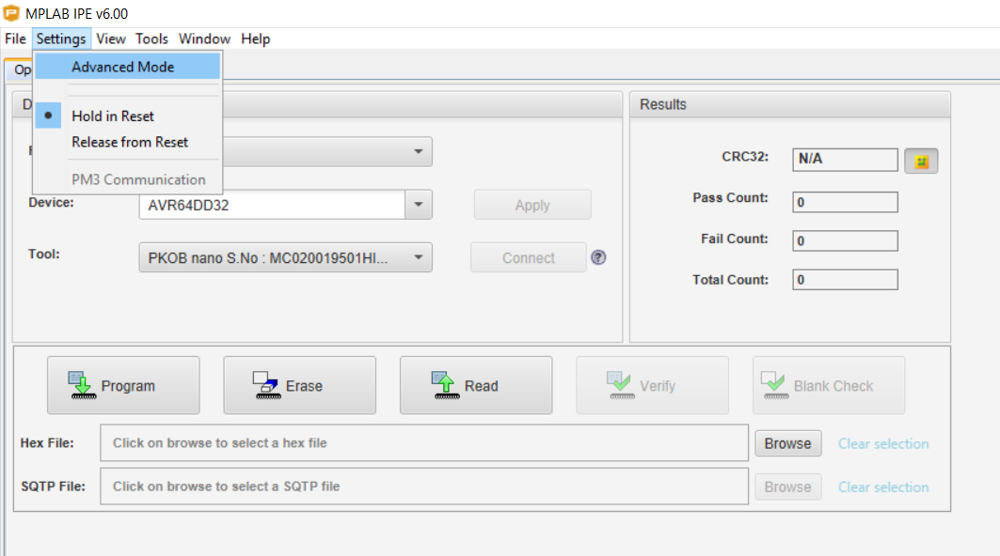
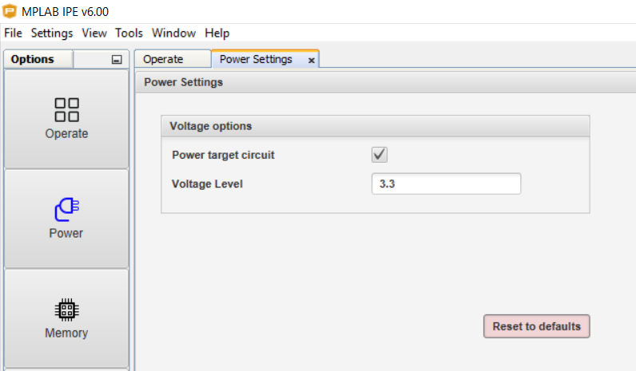
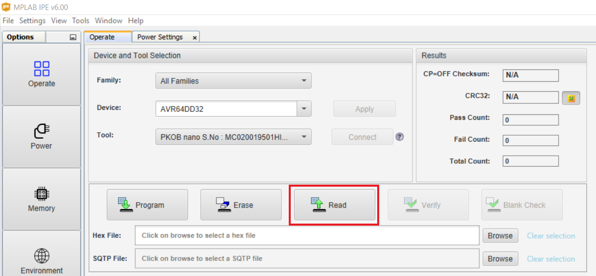
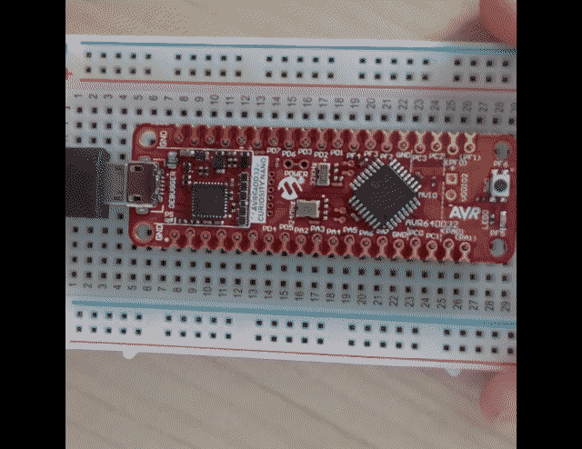

# Getting Started with BOD VLM Using the AVR64DD32 Microcontroller with MCC Melody

This code is generated using the Microchip Code Configurator and demonstrates the capabilities of the Brown-out-Detector (BOD) and the Voltage Level Monitor (VLM) peripherals. It starts by blinking the LED three times to signify a Reset. Then, if the supply voltage level falls below the VLM level, it turns the LED on and turns it off when it returns to the normal level. The board shuts down when the level drops below the BOD module and it resets when the supply voltage is in the correct range. The BOD level is set to 2.45V, and the VLM is set at 25% higher than that. The normal supply voltage is 3.3V.

## Related Documentation

More details and code examples on the AVR64DD32 can be found at the following links:

- [AVR64DD32 Product Page](https://www.microchip.com/wwwproducts/en/AVR64DD32)
- [AVR64DD32 Code Examples on GitHub](https://github.com/microchip-pic-avr-examples?q=AVR64DD32)
- [AVR64DD32 Project Examples in START](https://start.atmel.com/#examples/AVR64DD32CuriosityNano)

## Software Used

- [MPLAB® X IDE](http://www.microchip.com/mplab/mplab-x-ide) v6.00 or newer
- [MPLAB® X IPE](https://www.microchip.com/en-us/tools-resources/production/mplab-integrated-programming-environment) v6.00 or newer
- [MPLAB® XC8](http://www.microchip.com/mplab/compilers) v2.36 or newer
- [AVR-Dx Series Device Pack](https://packs.download.microchip.com/) v2.1.152 or newer

## Hardware Used

- The AVR64DD32 Curiosity Nano Development Board is used as a test platform
   

## Operation

To program the Curiosity Nano board with this MPLAB® X project, follow the steps provided in the [How to Program the Curiosity Nano Board](#how-to-program-the-curiosity-nano-board) chapter.  

## Setup
The following configurations must be made for this project:

- System clock is configured at 4 MHz
- VLM:
 	- VLM level: 25% above the BOD level
	- VLM interrupt: enabled, triggers when the signals crosses from both sides
- Pin PF5 is set as output

|    Pin    |  Configuration    |
| :-------: | :---------------: |
|    PF5    |   Digital output  |

## Demo

1. Connect the Curiosity Nano Development Board to the PC via USB. 

2. Open MPLAB® IPE and go to **Settings** and select **Advanced Mode** (if prompted to enter a password, the default is "microchip").

 

3. Select the connected device from the dropdown menu.
4. Go to **Power**, check the **Power target circuit** box and set the voltage level to 3.3V.

 

5. Go to **Operate** and click **Read**. This will set the voltage of the board to 3.3V. The board will make the LED blink three times.

 

 

6. Repeat the steps to set the voltage for the Curiosity Nano Development board and decrease the voltage below 3.06V, but above 2.45V. This will turn on the LED, signifying that the voltage is below the VLM. 

7. Decrease the voltage below 2.45V. The LED and the micrcontroller will turn off and they will turn back on when the power supply is set back to a voltage above 2.45V.

## Summary

This code example shows how to configure the VLM and BOD using the Microchip Code Configurator and demonstrates their use by turning the LED on or off, depending on the supply voltage. 
  
[Back to top](#getting-started-with-bod-vlm-using-the-avr64dd32-microcontroller-with-mcc-melody)
 

#

##  How to Program the Curiosity Nano Board

This chapter demonstrates how to use the MPLAB® X IDE to program an AVR® device with an Example_Project.X. This can be applied to any other project.

1.  Connect the board to the PC.

2.  Open the Example_Project.X project in MPLAB® X IDE.

3.  Set the Example_Project.X project as main project.
     Right click the project in the **Projects** tab and click **Set as Main Project**.
     

4.  Clean and build the Example_Project.X project.
     Right click the **Example_Project.X** project and select **Clean and Build**.
     

5.  Select **AVRxxxxx Curiosity Nano** in the Connected Hardware Tool section of the project settings:
     Right click the project and click **Properties**.
     Click the arrow under the Connected Hardware Tool.
     Select **AVRxxxxx Curiosity Nano** (click the **SN**), click **Apply** and then click **OK**:
     

6.  Program the project to the board.
     Right click the project and click **Make and Program Device**.
     

 

- [Back to top](#getting-started-with-bod-vlm-using-the-avr64dd32-microcontroller-with-mcc-melody)
